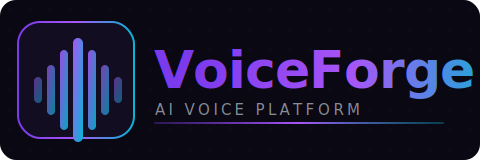

<p align="center">
  
</p>

<p align="center">
  <a href="https://voiceforge-gamma.vercel.app"></a>
  
  
  
  
</p>

<p align="center">
  Production-grade AI voice platform with multi-language TTS, voice cloning, and serverless GPU inference.<br/>
  Built as a full-stack AI engineering portfolio project.
</p>

---

## Features

- **Text to Speech** — 9 languages via dual-engine routing (XTTS v2 + Sarvam AI)
- **Voice Cloning** — Clone any voice from a short audio sample using Web Audio API analysis
- **Authentication** — Google OAuth + Email/OTP with per-user data isolation
- **Audio History** — Persistent library backed by Supabase Storage
- **Language Detection** — Automatic script-based mismatch detection with user warnings

## Supported Languages

| Engine | Languages |
|--------|-----------|
| **XTTS v2** (global) | English, French, German, Spanish, Hindi, Japanese, Chinese |
| **Sarvam AI** (Indian) | Hindi, Tamil, Telugu, Kannada, Malayalam, Bengali, Odia, Marathi |

## Architecture

```
React (Vercel)
    │
    ▼ HTTPS
FastAPI (Render)
    │                    │
    ▼                    ▼
RunPod Serverless    Supabase
(XTTS v2 / A40 GPU) (PostgreSQL + Storage)
    │
    ▼ (Indian langs)
Sarvam AI API
```

**Async Webhook Pattern:** TTS jobs are submitted to RunPod and processed asynchronously. The frontend polls for status; RunPod POSTs results to a webhook endpoint which uploads audio to Supabase Storage.

## Tech Stack

| Layer | Stack |
|-------|-------|
| Frontend | React 18, Context API, Web Audio API |
| Backend | FastAPI, Python 3.11, async/await |
| Inference | XTTS v2 (coqui-tts), RunPod Serverless (A40 GPU) |
| Indian TTS | Sarvam AI API |
| Database | Supabase PostgreSQL + Storage Buckets |
| Auth | Google OAuth 2.0, Email OTP (Gmail SMTP) |
| Deployment | Vercel (frontend), Render (backend), Docker (GPU worker) |

## Quick Start

**Prerequisites:** Python 3.11+, Node.js 18+, NVIDIA GPU (for local inference)

```bash
# Backend
cd backend
python -m venv venv && source venv/bin/activate
pip install -r requirements.txt
cp .env.example .env   # fill in credentials
uvicorn main:app --reload

# Frontend
cd frontend
npm install
cp .env.example .env.local   # fill in credentials
npm run dev
```

## Environment Variables

<details>
<summary>Backend <code>.env</code></summary>

```
SUPABASE_URL=
SUPABASE_SERVICE_KEY=
RUNPOD_API_KEY=
RUNPOD_ENDPOINT_ID=
GOOGLE_CLIENT_ID=
GOOGLE_CLIENT_SECRET=
GMAIL_USER=
GMAIL_APP_PASSWORD=
FRONTEND_URL=
WEBHOOK_SECRET=
```
</details>

<details>
<summary>Frontend <code>.env.local</code></summary>

```
VITE_API_URL=
VITE_SUPABASE_URL=
VITE_SUPABASE_ANON_KEY=
VITE_GOOGLE_CLIENT_ID=
```
</details>

## Docker (RunPod Worker)

```bash
docker build -t voiceforge-tts:local .
docker push your-dockerhub/voiceforge-tts:v8
```

Current production image: `smruthisridatta/voiceforge-tts:v8`

## Project Structure

```
VoiceForge/
├── frontend/src/
│   ├── pages/          # Studio, Voices, History
│   ├── context/        # Global state (AppContext)
│   └── components/
├── backend/
│   ├── main.py
│   ├── routes/         # auth, tts, webhook
│   └── services/       # tts_service (XTTS + Sarvam)
├── handler.py          # RunPod serverless entry
├── Dockerfile
└── requirements-runpod.txt
```

## Roadmap

- [x] **Phase 1** — Text-to-Speech platform
- [ ] **Phase 2** — Speech-to-Text (Whisper + Sarvam STT)
- [ ] **Phase 3** — Voice Agent platform (real-time STT → LLM → TTS)

---

<p align="center">
  Built by <strong>Smruthi Sri Datta</strong> &nbsp;•&nbsp; AI Enthusiast
</p>
