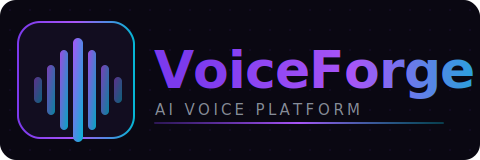

<p align="center">
  
</p>

<h1 align="center">VoiceForge</h1>

<p align="center">
  Production-grade AI voice platform — multi-language TTS, voice cloning, and serverless GPU inference.<br/>
  Built as a full-stack AI engineering project on a student budget.
</p>

<p align="center">
  <a href="https://voiceforge-gamma.vercel.app">
    
  </a>
  
  
  
  
</p>

---

## What is VoiceForge?

VoiceForge is a **full-stack, production-deployed Text-to-Speech platform** that competes functionally with commercial tools like ElevenLabs — built entirely on a student budget.

It supports **15 languages**, **voice cloning from audio samples**, and **persistent generation history**, running on serverless GPU infrastructure. Every engineering decision — from the webhook architecture to the audio proxy layer — was driven by real production constraints.

---

## Features

- **Text to Speech** — 9 languages via dual-engine routing (XTTS v2 + Sarvam AI)
- **Voice Cloning** — Clone any voice from a short audio sample
- **Authentication** — Google OAuth + Email/OTP with per-user data isolation
- **Audio History** — Persistent generation library backed by Supabase Storage
- **Language Detection** — Automatic script-based mismatch detection with user warnings
- **Audio Proxy Layer** — Backend proxy that bypasses ISP-level Supabase blocks for users in India

---

## Screenshots

<table>
  <tr>
    <td></td>
    <td></td>
  </tr>
  <tr>
    <td align="center"><b>Text to Speech Studio</b></td>
    <td align="center"><b>Voice Library</b></td>
  </tr>
  <tr>
    <td></td>
    <td></td>
  </tr>
  <tr>
    <td align="center"><b>Generation History</b></td>
    <td align="center"><b>Dashboard</b></td>
  </tr>
</table>

### Demo


---

## Supported Languages

| Engine | Languages |
|--------|-----------|
| **XTTS v2** (global) | English, French, German, Spanish, Hindi, Japanese, Chinese |
| **Sarvam AI** (Indian) | Hindi, Tamil, Telugu, Kannada, Malayalam, Bengali, Odia, Marathi |

---

## Architecture

```
React (Vercel)
      │
      │  authFetch + JWT
      ▼
FastAPI (Render)
      │                         │
      ▼                         ▼
RunPod Serverless           Supabase
(XTTS v2 / A40 GPU)    (PostgreSQL + Storage)
      │
      ▼ (Indian languages)
Sarvam AI API
      │
      ▼ webhook on completion
FastAPI updates DB record
      │
      ▼
Audio Proxy Layer → streams MP3 to browser
```

### Architecture Decisions

| Decision | Reason |
|---|---|
| **Webhook + Polling** instead of WebSocket | Render free tier kills connections after 30s; RunPod jobs take 5–30s. Webhooks avoid open connections entirely. |
| **Serverless GPU** (RunPod) | Pay only per inference second — no idle GPU cost on a student budget. |
| **Audio Proxy Layer** | Indian ISPs block `*.supabase.co` under IT Act Section 69A. Routing audio through Render bypasses the block transparently. |
| **Unauthenticated proxy endpoints** | HTML `<audio>` elements cannot attach JWT headers. Files are already public in Supabase Storage — no security lost. |
| **Dual TTS engines** | XTTS v2 for global languages (best quality); Sarvam AI for Indian languages (optimized for Indian accents and scripts). |

---

## Tech Stack

| Layer | Technology |
|-------|-----------|
| **Frontend** | React 18, Vite, Context API, Web Audio API |
| **Backend** | FastAPI, Python 3.11, async/await |
| **GPU Inference** | XTTS v2 (coqui-tts), RunPod Serverless (A40 GPU) |
| **Indian TTS** | Sarvam AI API |
| **Database** | Supabase PostgreSQL + Storage Buckets |
| **Auth** | Google OAuth 2.0, Email OTP via Gmail SMTP |
| **Deployment** | Vercel (frontend), Render (backend), Docker (GPU worker) |

---

## Engineering Challenges Solved

### 1. ISP-level Supabase blocking (India)
Indian ISPs block `*.supabase.co` by government order (IT Act Section 69A, Feb 2026). Audio files stored in Supabase were unreachable for users in India. Solution: built a backend proxy layer routing all audio through Render — transparent to users, no changes to the frontend audio player.

### 2. JWT auth incompatibility with media elements
`<audio src="...">` makes plain browser GET requests with no Authorization headers. Removing auth from proxy endpoints was the correct fix — Supabase Storage objects are already public, so no security is lost. This follows standard industry patterns for media delivery.

### 3. Render 30-second connection timeout
FastAPI on Render's free tier closes connections after 30 seconds. TTS generation takes 5–30 seconds. Solution: submit job → return `job_id` immediately → RunPod fires a webhook on completion → frontend polls for status. No open connections, no timeouts.

### 4. Webhook user ID mismatch
The webhook completion handler was saving audio records with `user_id = "webhook"` instead of the real user ID. Fixed by saving a pending DB record with the actual user ID at job submission time, then only updating the `audio_url` field on webhook completion.

### 5. bcrypt + passlib compatibility
`bcrypt >= 4.1` silently breaks `passlib`. Pinned to `bcrypt==4.0.1`.

---

## Local Setup

**Prerequisites:** Python 3.11+, Node.js 18+

```bash
git clone https://github.com/Smruthi-Sri-Datta/Voiceforge.git
cd Voiceforge
```

### Backend

```bash
pip install fastapi uvicorn sqlalchemy psycopg2-binary httpx python-dotenv \
            passlib python-jose pydantic email-validator authlib \
            python-multipart bcrypt==4.0.1 "supabase==2.10.0"
```

Create `backend/.env`:

<details>
<summary>Backend <code>.env</code> variables</summary>

```env
DATABASE_URL=your_supabase_postgres_url
SECRET_KEY=your_jwt_secret
GOOGLE_CLIENT_ID=your_google_client_id
GOOGLE_CLIENT_SECRET=your_google_client_secret
GMAIL_USER=your_gmail
GMAIL_PASSWORD=your_gmail_app_password
SARVAM_API_KEY=your_sarvam_key
SUPABASE_URL=your_supabase_url
SUPABASE_SERVICE_KEY=your_supabase_service_key
RUNPOD_URL=your_runpod_endpoint
RUNPOD_API_KEY=your_runpod_key
BACKEND_URL=http://localhost:8000
```
</details>

Run from project root:
```bash
python -m uvicorn backend.main:app --reload --port 8000
```

### Frontend

```bash
cd frontend
npm install
```

Create `frontend/.env`:
```env
VITE_BACKEND_URL=http://localhost:8000
```

```bash
npm run dev
```

Open **http://localhost:5173**

---

## Docker (RunPod Worker)

```bash
docker build -t voiceforge-tts:local .
docker push your-dockerhub/voiceforge-tts:v8
```

Current production image: `smruthisridatta/voiceforge-tts:v8`

---

## Project Structure

```
VoiceForge/
├── frontend/
│   └── src/
│       ├── pages/          # Studio, Voices, History
│       ├── context/        # Global state (AppContext, HistoryContext)
│       └── components/     # AudioPlayer, VoiceCard, etc.
├── backend/
│   ├── main.py
│   ├── database.py
│   ├── models.py
│   └── routes/             # auth, tts, webhook
├── handler.py              # RunPod serverless entry point
├── Dockerfile
├── requirements-runpod.txt
└── requirements-render.txt
```

---

## Roadmap

- [x] **Phase 1** — Full-stack TTS platform (complete)
  - Multi-language TTS, voice cloning, auth, history, audio proxy
- [ ] **Phase 2** — Speech-to-Text (Whisper + Sarvam STT)
- [ ] **Phase 3** — Real-time voice agent (STT → LLM → TTS pipeline)
- [ ] **Phase 4** — RAG-powered voice assistant

---

<p align="center">
  Built by <strong><a href="https://linkedin.com/in/smruthisridatta">Smruthi Sri Datta</a></strong>
  &nbsp;•&nbsp;
  <a href="https://github.com/Smruthi-Sri-Datta">GitHub</a>
  &nbsp;•&nbsp;
  AI Master's Student 
</p>

<p align="center">
  <sub>Built on a student budget — because good engineering doesn't require a big one.</sub>
</p>
